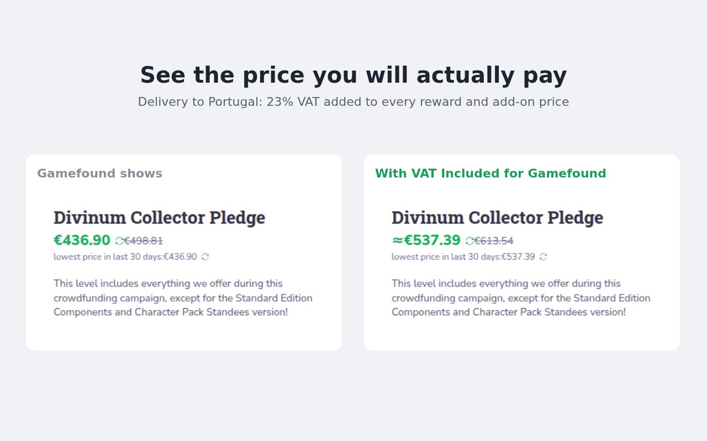

# VAT Included for Gamefound

[](https://addons.mozilla.org/firefox/addon/vat-included-for-gamefound/)
[](https://chromewebstore.google.com/detail/daphjimleehgiadinjjmjlpcekfkfhag)

A browser extension for Firefox and Chrome that shows Gamefound reward and add-on prices **with the VAT for your delivery country included**. Unofficial and not affiliated with Gamefound.



Gamefound lists prices before tax and adds VAT at checkout. Once you have a pledge your cart includes VAT but the reward cards don't, so the numbers on the page never match your cart. This extension replaces each price with the price you will actually pay, in whatever display currency you picked; it does no currency conversion of its own.

- The "Delivery to" bar shows the rate applied, e.g. `· prices incl. 23% VAT`. Hover it to see where the rate came from; click it to switch back to the original prices.
- The toolbar button has the same switch ("Show prices incl. VAT"), remembered across pages.
- `≈` in front of a price means the rate is an estimate.

## Where the rate comes from

1. **Your pledge on this project (exact).** Gamefound's cart lists the rates it charges you, per product, and the name it uses for the tax. No `≈`.
2. **Your past Gamefound orders (estimate).** With no pledge on the project, the extension uses the standard rate Gamefound charged on your 10 most recent orders to the same delivery location (the most common one). Refreshed at most once a day, only while you are logged in.
3. **A built-in table (estimate).** Standard EU and UK rates, including the Azores and Madeira, in [`src/vat-rates.ts`](src/vat-rates.ts) with sources and the date checked.
4. **Nothing.** Outside the EU and UK the rate depends on the creator, so without a pledge on the project the page is left as it is.

Projects without tax handling are left untouched, and so are the "Your pledge" and checkout pages, which already include tax.

Known limitation: a product with a reduced rate (e.g. books in some countries) shows the standard rate unless it is already in your cart.

## Privacy

Everything happens in your browser; nothing is sent anywhere. See [PRIVACY.md](PRIVACY.md).

## Install

- **Firefox:** [addons.mozilla.org](https://addons.mozilla.org/firefox/addon/vat-included-for-gamefound/)
- **Chrome:** [Chrome Web Store](https://chromewebstore.google.com/detail/daphjimleehgiadinjjmjlpcekfkfhag)
- **From a release:** download the zip for your browser from [Releases](https://github.com/lsequeiraa/gamefound-vat/releases). In Chrome, unzip it and use *Load unpacked* in `chrome://extensions` (Developer mode). In Firefox, `about:debugging#/runtime/this-firefox` → *Load Temporary Add-on* loads it until Firefox restarts.

## Build from source

Requires [Bun](https://bun.sh) **1.3.13** (the version in `package.json`'s `packageManager`) on Linux, macOS or Windows.

```sh
bun install --frozen-lockfile
bun run build        # dist/firefox and dist/chrome
```

`dist/firefox` is byte-for-byte what is submitted to addons.mozilla.org; the release workflow checks that by rebuilding from the source archive. The two builds differ only in the manifest: Chrome's has no `browser_specific_settings`.

## Development

```sh
bun test             # unit and DOM tests (happy-dom); fixtures captured from gamefound.com
bun run typecheck
bun run lint         # build + web-ext lint, Firefox's validator
bun run package      # zips for both browsers plus the source archive, into artifacts/
bun run firefox      # build and run in a fresh Firefox profile
```

It relies on Gamefound's internal, undocumented API (`/api/carts/getCartSummary`, `/api/carts/getCartDetails`, `/api/locations/getProjectLocations`, `/api/users/getBackerCenterPledges`, `/api/orders/getOrderDetails`) and on the site's `data-qa` attributes. If Gamefound changes them the extension stops changing prices rather than showing wrong ones; the tests in `test/` pin the shapes it expects.

## Releasing

1. Bump `version` in `package.json` and commit.
2. Tag it with a message, which becomes the release notes: `git tag -a v1.2.3 -m "What changed"`.
3. Push the commit and the tag.

The [release workflow](.github/workflows/release.yml) then tests and builds, creates the GitHub Release, submits the version to addons.mozilla.org (`web-ext sign --channel listed`, with the source archive) and to the Chrome Web Store (API v2, service account). Both stores still review each version before users get it. The store listing text lives in [`store/`](store/).

Secrets the workflow uses: `AMO_API_KEY`, `AMO_API_SECRET`, `CWS_SERVICE_ACCOUNT_JSON`, `CWS_PUBLISHER_ID`, `CWS_ITEM_ID`. A store whose secrets are missing is skipped.

## License

[MIT](LICENSE)
